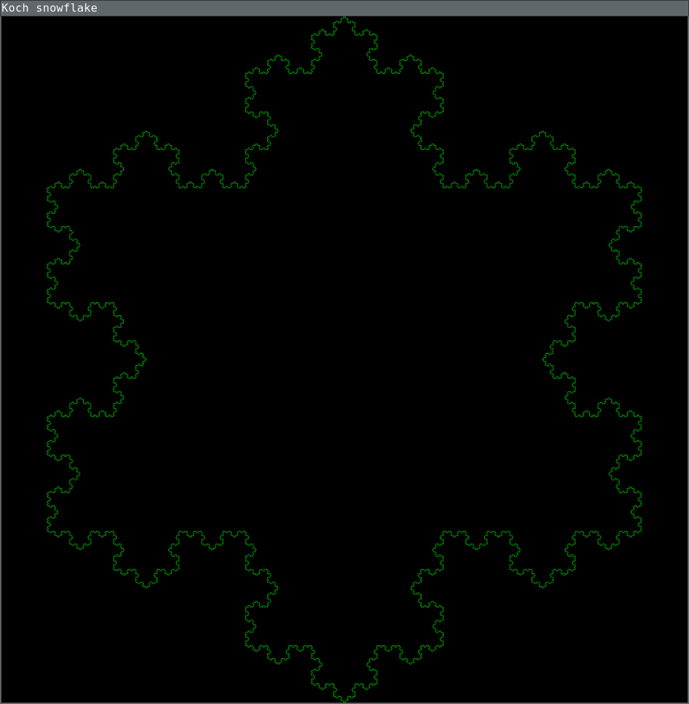

# Koch Snowflake

This is just a Rust exercise.

## Running from source code:

```
cargo build
cargo run
```

## Expected output

It will open a black window and draw the fractal on the screen, incrementing one
iteration every second.


